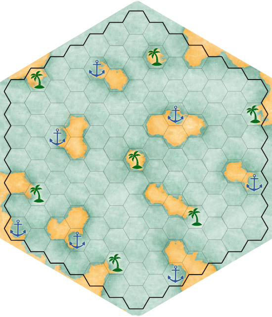

# V kostce

Týmy proti sobě. Týmy mají **lodě**. Na mapě jsou **přístavy** a **plantáže**, v přístavech se **obchoduje**, plantáže se **plundrují**. Lodě vezou náklad, **útočí** na sebe, lze je poškodit či zabít. Z mrtvé lodi se stane vrak, ten lze plundrovat.

Cíl: Získat co nejvíc peněz. (A implicitně: mít nejepičtější flotilu v Karibiku.)

Jak: Tahová strategie. Každý tým zadá tahy svých lodí, na konci kola se všechny najednou vyhodnotí. 

Následují detailní pravidla.

# Pravidla vs. implementace

Tato pravidla mají orientační charakter. **Pravdu má vždy implementace**, tedy je to tak, jak se to ve výsledku stane.

Pokud nevíte, co se v nějakém případě stane, je součástí hry to zjistit. Pokud z pravidel není jasná nějaká konstanta, je součástí hry na ni přijít (dle povahy konstanty může jít zjistit přímo přesnou hodnotu, nebo pouze její chování / intuici).

Pravidla nemusíte číst, můžete hrát hru intuitivně, podle toho, co vás nechá zadat. Nemusíte se učit, které kombinace tahů jsou povolené, hra to hlídá za vás.

## Výjímka
Následující si ohlídejte sami, spoleháme na vaše fair play:

1. Nesnažte se vyhackovat plantáže pomocí opakovaného zadávání Plundrování.
   * Formálně: Na každé plantáží / vraku smíte zadat Plundrování z každé lodi maximálně jednou za tah.
   * _ Poznámka: Hra vás nenechá vyplundrovat víc, než tam je. Ale šlo by takto předbíhat, kdyby plundrovalo více lodí současně. _  
2. Pokud objevíte chování, které se dá intuicí považovat spíše za hack, tak ho nezneužívejte, ale domluvte se s ostatními, jak ho (ne)používat.   

# Mapa

- typy polí:
  - **širé moře **
  - **širá pevnina ** - na ni lodě vůbec nemůžou
  - **přístav **
  - **plantáž ** - dá se vyplundrovat a získat tak komodity. Je obecní (tj. nikomu nepatří).
  - **vrak  -** zůstane po zničené lodi, dá se vyplundrovat. Občas se může objevit sám od sebe
- Loď je vždy orientována přídí směrem k nějakému sousednímu poli, tj. loď má pole před sebou, pole za sebou, pole vlevo šikmo vpředu, pole vlevo šikmo vzadu, pole vpravo šikmo vpředu, pole vpravo šikmo vzadu.

- Na jednom poli nesmí stát více lodí současně. Výjimkou z tohoto pravidla je pole** _ **Přístav** _ **, kde může být libovolně mnoho lodí současně.

## Souřadnicový systém
Používáme tzv. _axial coordinates_ (trapezoidální souřadnice), se složkami _Q_ a _R_. Pro hraní hry není potřeba je víc chápat.

Používáme je, protože tvoří euklidovský prostor - vznikají z 3D souřadnic roviny šikmo procházející krychlí. Pokud vás to zajímá, detaily (interaktivní, s obrázky) naleznete např. zde https://www.redblobgames.com/grids/hexagons/.  

## Přístav:

- neutrální místo, na loď v přístavu se nesmí útočit, ani z přístavu se nesmí útočit. Dá se v něm:

    - upgradovat loď
    - koupit vylepšení
    - koupit komodity, prodat komodity
    - pravit loď
- ceny za komodity jsou ve všech přístavech stejné. Výjímečně se mohou v jednotlivých dnech měnit.

## Plantáže:

- Umožňuje akci **plundrování** (nakládka)
- Nesmí zde více lodí skončit svůj tah

Nakládka probíhá následovně:

- V jednotlivých typech surovin se seřadí lodě podle počtu chtěné suroviny
- Od nejmenšího počtu budou dostávat suroviny ze zdroje do té doby, dokud zdroj nedojde, nebo nejsou odbaveny všechny lodě
- Příklad:
  - Loď A, B. A chce 6 rumů a 4 stromy. B chce 5 rumů a 5 stromů
  - Plantáž obsahuje 10 rumů a 10 stromů
  - Stromy se naloží takto: méně chce A -&gt; dostane 4, potom B -&gt; dostane 5
  - Rumy: B chce méně -&gt; dostane 5, potom A -&gt; chce 6, ale ve zdroji je už jen 5 -&gt; dostane 5

## Vrak (potopené lodě):

- Z potopené lodě se stane Vrak (dočasné plundroviště)

    - Těží se stejně jako na plantážích
    - Až se vytěží, tak zmizí
    - Jako surovinu bude obsahovat i peníze

- Občas se může objevit jen tak

## Komodity (suroviny):

- **kov, dřevo, plátno, rum**
- komodity lze výhodně prodat v přístavu a všechny kromě kovu tam jde nevýhodně koupit
  - kov se netěží, nekupuje - lze jej získat pouze z lodí
- komodity lze získat plundrováním lodí a plantáží
- **kov, dřevo a plátno** jsou třeba na vylepšování lodí a na stavbu nových lodí
- **rum** lze velmi výhodně prodat
- Každý _tým_ má **centrální virtuální sklad komodit** , z něhož používá suroviny a peníze pro stavbu nových lodí a další poplatky. 
- Každá _loď_ má vlastní **nákladový prostor**, v němž může uchovávat suroviny, a pokladnu peníze. Tyto suroviny se nepočítají do surovin týmu a nelze je použít pro stavbu nových lodí ani vylepšení. Loď může v přístavu pomocí akce vyložit suroviny a tím je přesunout do centrálního skladu svého týmu.
- Každá loď má omezenou **kapacitu** svého nákladového prostoru. Peníze v pokladně místo nezabírají.

# Tah

Hra probíhá na tahy, přičemž hrají **všechny lodě současně**. 

## Akce

Akce jsou tří druhů:
* manévry
* útoky
* transakce

Je to ale složitější. Transakce se dělí na _ modifikující transakce _ a _ transkace-manévry _. Nemusíte to chápat, hra vás navede.

### Modifikující transakce

Tyto akce se mohou naplánovat, pouze pokud se loď na začátku tahu nachází v přístavu. Mohou být provedeny pouze na začátku tahu. Jejich efekt bude proveden ihned a nelze vzít zpět.

* **Zakoupení nových vylepšení**
* **Upgrade lodě** (nelze aplikovat na galeonu)
* **Oprava lodě**
* **Oprava zakoupených vylepšení**

### Manévry

V každém tahu smí být nejvýše tolik manévrů, jako je rychlost lodě.

#### Pohybové manévry:
- **pohyb kupředu** o 1 pole ve směru přídě
- **otočení doleva** o 60° 
- **otočení doprava** o 60°

#### Transakce-manévry:
- **Prodej/nákup komodit**
  - Lze pouze v přístavu.
  - Lze prodat suroviny, které se nacházejí na lodi a v **Centrálním skladu komodit** , lze nakoupit do **Centrálního skladu komodit**.
- **Vyložení nákladu**
  - Lze pouze v přístavu.
  - Suroviny z lodi se přesunou do **Centrálního skladu komodit**.

- **Nakládka komodit**
  - Lze naložit komodity z plantáží nebo z vraků. Je potřeba nacházet se na daném políčku.
  - Průběh nakládky je definován v popisu **Plantáží** v sekci **Mapa**.

### Útoky

Útoky označené slovem **BONUS** se zpřístupní až po zakoupení patříčného vylepšení v přístavu, viz tabulka vylepšení.

* **salva děl na levoboku**
  1. Způsobí zranění všem lodím, které se nachází na polích vlevo šikmo vpředu a vlevo šikmo vzadu (všem, tj. i přátelským).
  2. Síla zranění je rovna počtu **děl útočící lodě**.
* **salva děl na pravoboku**
  1. (analogicky)
* **čelní útok**
  * Je-li na poli před útočící lodí nepřátelská loď, je zasažena silou **10 bodů**.
  * Útočící loď sama utrpí zranění **5 bodů.**
  * Je-li pole prázdné, nestane se nic. Je-li soupeř natočen přídí, **nestane se nic.**
  * Je-li tímto útokem soupeřova loď zničena, přesune se útočník na pole, na něž útočil.
  * Předchází-li v tahu této akci bezprostředně akce **pohyb kupředu** , přičítá se k síle zásahu bonus **5 bodů** (&quot;čelní útok s rozjezdem&quot;).
* **BONUS: salva řetězovou střelou na levoboku/pravoboku **
  1. Použití je jako v případě klasické salvy, efekt se však liší: zasažená loď nesmí v dalším tahu použít akci **pohyb kupředu** (jakoby si do příštího tahu s sebou nese &quot;zásah řetězem&quot;).
  2. Vůbec nedochází k poškození zasažené lodi.
* **BONUS: střela z houfnice**
  1. Střela s vysokou balistickou křivkou, která je dopadne až poté, co se vyhodnotí pohyby lodí v daném kole.
  2. Síla houfnice je **10.**
  3. Na typu lodě závisí dva parametry:_ **počet houfnic** _ a _ **dostřel** _. První udává počet střel, které lze zcela nezávisle na sobě zamířit a vystřelit, druhý maximální vzdálenost (jako počet políček) od lodě, na něž lze střelu zamířit.
* **BONUS: salva těžkou kulí na levoboku/pravoboku **
   * Funguje podobně jako klasická salva s těmito rozdíly:
     * uštědřený zásah se spočte jako **1.5**   **\***   **počet děl**
     * použije-li se tato akce, pak to musí být jediná akce v daném tahu.
     
* Poznámka: friendly fire existuje.

## Omezení tahu

Nemusíte je hlídat, hra je hlídá za vás. Pokud vás hra nechá udělat něco, co podle těchto omezení nejde, je to v pořádku.

**Varování**: může se také stát, že vás hra nechá *naplánovat* nějakou akci, která dle pravidel nelze provézt, a hra na to přijde až při vyhodnocení a akci *neprovede*.

### Manévry
- Omezení pro **fregatu:**
  - V každém tahu smí být nejvýše dvakrát akce **pohyb kupředu** (tj. nelze provést tah **\[pohyb kupředu, pohyb kupředu, pohyb kupředu]**)
- Omezení pro **galeonu** :
  - V každém tahu smí být nejvýše jednou akce **pohyb kupředu** (tj. nelze provést tah **\[pohyb kupředu, pohyb kupředu]**)
  - V každém tahu smí být nejvýše jednou jedna z akcí **otočení doleva o 60°, otočení doprava o 60°.**

### Útoky
- V každém tahu smí být nejvýše jednou jedna z akcí **salva děl na levoboku, salva řetězovou střelou na levoboku, salva těžkou kulí na levoboku.**
- V každém tahu smí být nejvýše jednou jedna z akcí **salva děl na pravoboku, salva řetězovou střelou na pravoboku, salva těžkou kulí na pravoboku.**
- V každém tahu smí být nejvýše jedna akce **střela z houfnice.**
- V každém tahu smí být nejvýše jedna akce **čelní útok.**
- Nesmí se útočit z pole _Přístav_ ani na pole _Přístav._

### Obecná omezení
- Je-li použita akce **salva těžkou kulí** , pak to musí být jediná akce v daném kole.
- Tah nesmí obsahovat **Útok** a **Plundrování** současně
- Na každé plantáží / vraku smíte zadat Plundrování z každé lodi pouze jednou za tah.

## Vyhodnocení tahů

Vyhodnocování je trochu **časoprostorově ohnuté**. Každá loď se pohybuje podle zadaných tahů a u toho střílí salvami na ostatní lodě na jejich **původních pozicích** (jaké měly na začátku tahu). Když střílejí ostatní na ni, tak přitom také střílejí na její původní pozici. Je to taková **střela do minulosti**.

Intuice salvy: Pokud střílím salvou, tak střílím na to, co vidím na mapě. Pokud chci utíkat, tak v tomto kole už salvám neuteču - ostatní můžou přijet přímo ke mně. 

Intuice houfnice: Pokud střílím houfnicí, musím tipnout, kam nepřítel dojede. 

Tahy se vyhodnocují takto:

1. provedou se Modifikující transakce
1. připraví se **pohybové manévry**, vyhodnocovaná loď vnímá pouze svůj pohyb zatímco útočí, ostatní stojí na původním místě
2. vyhodnotí se **všechny salvy** (obyčejná, řetězová, těžká) a **čelní útok** , zasaženým lodím se uberou životy. 
3. vyhodnotí se **pohybové manévry** lodí, všechny lodě se přesunou na cílová políčka
4. vyhodnotí se **houfnice**
5. vyhodnotí se **plundrování**
6. lodě, které mají životy &lt;= 0 jsou **zničeny** a na místě, kde začínaly tah se z nich stane **vrak**
7. vyhodnotí se kolize

_ Poznámka: Pokud vám časoprostorové ohnutí stále nedává smysl, takto je to implementované:
Zafixují se všechny lodě kromě té právě vyhodnocované - ta pluje a střílí kolem sebe. Když dopluje, tak se vrátí na svoje původní místo. Takto se vyhodnotí všechny lodě. Pak se ještě jednou provedou manévry lodí, už be střel. _ 

### Vyhodnocení kolizí

Pokud se stane, že na jednom políčku, které není přístav, skončí svůj tah více lodí, tak nastává kolize, která se bude řešit takto:

Opakuj, dokud existuje kolize:

(1) Pokud se více lodí potká na jednom políčku, tak na něm zůstane:

1. loď, pro niž je to výchozí políčko (pokud taková existuje)
2. největší loď
  1. pokud je takových lodí více, tak zůstane loď s nejvíce věcmi v nákladovém prostoru
  2. pokud stejně, tak náhodná

(2) Zbylé lodě se vrátí na pole, z nějž na kolizní pole přijeli (t.j. o jeden krok zpět)

- Lodě, které se účastnily kolize budou poškozeny.
  - Poškození se bude počítat jen jednou.
  - Hodnota poškození bude stejná, jako kdyby loď útočila čelně bez klounu, tedy **5**.
  - Na toto poškození lze zemřít.  

## Zakoupení nové lodě

**Kdykoliv během tahu** se tým může rozhodnout postavit novou loď. Loď se objeví ihned.

TODO může se s ní hrát ihned nebo ne?

## Povýšení stávající lodě

V přístavní fázi lze loď povýšit na lepší typ lodi. V takovém případě je cena menší, než pokud by se jednalo o koupení nové lodě - je slevněna o polovinu ceny současné lodi.

Současná loď se tímto přemění na loď vyššího typu, zůstávají ji současná vylepšení i věci ve skladu.

Pokud byla poničená, tak bude mít nyní plné životy. TODO fakt?

## Opravení stávající lodě

V přístavní fázi lze loď opravit. V takovém případě se za příslušnou cenu nastaví její životy na maximum, veškeré její ostatní věci zůstávají nezměněné.

## Zničená loď

- ztrácí všechny komodity
- resetuje se do nejbližšího přístavu ve &quot;zničeném&quot; stavu
- zničenou loď lze **opravit** dvěma způsoby:
  - **zaplacením 1/10 její kupní ceny**
    - zakoupená vylepšení (např. houfnice, přídavné kanóny) jsou zničena společně s lodí a lze je opravit opět za 1/10 kupní ceny
      - není třeba je opravovat ihned, je možno např. opravit loď a vyplout na moře se zničenou houfnicí; tu pak opravit někdy později, jakmile budou peníze
  - **degradováním na nižší třídu** , tj. např. zničenou fregatu lze ponížit na plně funkční brigu
    - při &quot;opravou degradací&quot; zůstávají vylepšení zničená a lze je opravit pouze zaplacením 1/10 jejich kupní ceny
    - loď **ztrácí** všechna vylepšení, která jsou nekompatibilní s jejím aktuálním typem
      - např. mám-li zničenou brigu s houfnicí, mohu ji opravit degradováním na škuner, ale přijdu přitom o houfnici (tj. při případném budoucím povýšení zpět na brigu už houfnici nemám a musím si ji znova koupit)
- na místě smrti se objeví **vrak** , který bude obsahovat komodity určené jednak nákladem, jednak typem potopené lodě

- Pokud tým má zničené všechny lodě a nemá dostatek surovin, aby si mohl koupit další nebo opravit stávající, tak se mu zdarma opraví nejlevnější (bude to vždy škuner). Toto se **nestane automaticky**, kontaktujte orga.

# Typy lodí

| | **Škuner**  | **Briga** | **Fregata**  | **Galeona** |
| --- | --- | --- | --- | --- |
| **Životy**  | 30 | 45 | 70 | 100 |
| **Počet děl** (na 1 boku) | 8 | 12 | 20 | 30 |
| **Nákladní prostor** | 250 t | 480 t | 800 t | 1200 t |
| **Rychlost** | 4 | 3 | 3 | 2 |

# Vylepšení

| | **Škuner**  | **Briga** | **Fregata**  | **Galeona** |
| --- | --- | --- | --- | --- |
| **Vyztužení trupu** | +5 odolnost | +10 odolnost | +15 odolnost | +20 odolnost |
| **Řetězová střela** | zpřístupnění akcí **salva řetězovou střelou na levobok/pravobok** |
| **Přídavná děla** | +2 počet děl | +3 počet děl | +5 počet děl | +7 počet děl |
| **Houfnice** | x | zpřístupnění akce **střela z houfnice** s parametry: |
| | | počet houfnic=1,dostřel=2 | počet houfnic=2,dostřel=2 | počet houfnic=4,dostřel=3 |
| **Kloun** | x | x | při akci **čelní útok** se zvyšuje zásah o 5 a zároveň se redukuje utrpěné poškození na 0 | při akci **čelní útok** se zvyšuje zásah o 10 a zároveň se redukuje utrpěné poškození na 0 |
| **Těžká kule** | x | x | x | zpřístupnění akcí **salva těžkou kulí na levobok/pravobok** |

# Ostatní

## Zdrojový kód
Pro zvídavé informatiky: https://github.com/jagotu/LosPiratos/. Pro pravidla nejdůležitější třída je `StandardGameEvaluator` z package `com.vztekoverflow.lospiratos.evaluator` a třídy jednotlivých akcí z package `com.vztekoverflow.lospiratos.viewmodel.actions`.